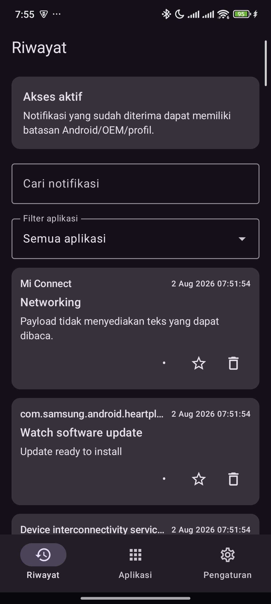

# NotifPlus 🔔

<p align="center">
  
</p>

<p align="center">
  <strong>Privacy-First Android Local Notification History & Media Archiving Application</strong>
</p>

<p align="center">
  
  
  
  
  
  
</p>

---

## 📌 Project Overview

**NotifPlus** adalah aplikasi pencatat dan pengarsip riwayat notifikasi lokal (*local notification history*) untuk perangkat Android dengan standar keamanan dan privasi tingkat tinggi (**Zero-Internet Privacy & DevSecOps Best Practices**).

Seringkali pesan atau notifikasi penting diubah, dihapus, atau ditarik oleh pengirim pada aplikasi perpesanan (misalnya WhatsApp, Telegram, dll.), atau tidak sengaja terhapus dari panel notifikasi sistem. NotifPlus menangkap setiap peristiwa notifikasi yang masuk melalui `NotificationListenerService` secara *immutable snapshot*, sehingga riwayat pesan awal beserta lampiran medianya tetap tersimpan secara aman di penyimpanan privat perangkat.

### 🛡️ Filosofi Keamanan & Privasi (Zero-Internet Architecture)
- **Zero Internet Permission**: NotifPlus **tidak meminta ataupun mendeklarasikan izin akses internet (`android.permission.INTERNET`)**. Data notifikasi Anda tidak akan pernah keluar dari perangkat.
- **App-Sandboxed Storage**: Database SQLite (Room) dan file lampiran media disimpan di penyimpanan internal privat (`filesDir`), serta dikecualikan dari Android Cloud Backup (`allowBackup="false"`).
- **No Log Leaks**: Konten notifikasi sensitif tidak pernah dicetak ke log sistem (`Logcat`).
- **Biometric Security**: Dilengkapi proteksi autentikasi biometrik bawaan (Fingerprint / Face Unlock).

---

## ✨ Fitur Utama

- 📸 **Immutable Notification Snapshots**: Setiap perubahan notifikasi (diedit, diganti, atau dihapus) disimpan sebagai snapshot terpisah yang tidak dapat ditimpa.
- 🖼️ **Media Attachment Extractor**: Mengunduh dan mengarsipkan gambar/media lampiran notifikasi (hingga 50 MB) secara otomatis sebelum notifikasi aslinya hilang.
- 🔍 **Pencarian & Pemfilteran Canggih**: Cari notifikasi berdasarkan teks, nama aplikasi asal, rentang waktu, atau status lampiran.
- 🧹 **Retention Lifecycle & Automated Cleanup**: Pengaturan masa retensi arsip (default: 30 hari) yang dibersihkan secara berkala menggunakan Android `WorkManager`.
- ⚡ **Per-App Auto-Dismiss Rules**: Opsi untuk otomatis menutup notifikasi asli per-aplikasi setelah notifikasi berhasil tersimpan di NotifPlus.
- 🔒 **Biometric App Lock**: Mengunci akses ke riwayat notifikasi menggunakan sensor biometrik perangkat.
- 📦 **Export & Archive Transfer**: Ekspor riwayat notifikasi yang sepenuhnya dikendalikan oleh pengguna.

---

## 🛠️ Stack Teknologi

Aplikasi ini dibangun menggunakan arsitektur modern Android (*Clean Architecture + MVVM*):

| Komponen | Teknologi / Library |
| --- | --- |
| **Language** | Kotlin 2.0.21 |
| **Build System** | Gradle 8.9 / Android Gradle Plugin (AGP) 8.7.3 (Kotlin DSL) |
| **Min / Target SDK** | Android 10 (API 29) / Android 15 (API 36) |
| **UI Framework** | Jetpack Compose (BOM 2024.12.01) + Material 3 |
| **Icons & Design** | Material Icons Extended |
| **Architecture** | Clean Architecture (Domain, Data, Presentation, UI, Service) |
| **Dependency Injection** | Dagger Hilt 2.53.1 + Hilt Navigation Compose + Hilt Work |
| **Database & ORM** | AndroidX Room 2.7.0 (KSP, Room Paging, Migrations) |
| **Preferences** | AndroidX DataStore Preferences 1.1.2 |
| **Background Tasks** | AndroidX WorkManager 2.10.0 |
| **Paging** | AndroidX Paging 3.3.5 |
| **Image Loading** | Coil Compose 2.7.0 |
| **Security / Biometrics** | AndroidX Biometric 1.1.0 |
| **Serialization** | Kotlinx Serialization JSON 1.7.3 |
| **Testing** | JUnit 4, Google Truth, Kotlinx Coroutines Test, Espresso, AndroidX Test Core |
| **DevSecOps & CI/CD** | GitHub Actions, Gitleaks Secret Scanning, Android Lint SAST |

---

## 🏗️ Struktur Proyek

```
NotifPlus/
├── .github/
│   └── workflows/
│       └── devsecops-ci.yml       # Automated Build, Test, Lint & Secret Scanning
├── app/
│   ├── src/
│   │   ├── main/
│   │   │   ├── java/com/notifplus/
│   │   │   │   ├── data/          # Room Database, DAOs, Entities, Repositories
│   │   │   │   ├── di/            # Hilt Dependency Injection Modules
│   │   │   │   ├── domain/        # Models, UseCases, Repository Interfaces
│   │   │   │   ├── presentation/  # ViewModels (History, Detail, Settings, Access)
│   │   │   │   ├── service/       # NotificationCaptureService & Workers
│   │   │   │   └── ui/            # Jetpack Compose Screens, Components, Theme
│   │   │   ├── res/               # Drawables, Strings, XML Data Rules
│   │   │   └── AndroidManifest.xml
│   │   └── test/                  # Unit Tests (JUnit & Truth)
│   └── build.gradle.kts
├── gradle/
│   └── libs.versions.toml         # Version Catalog
├── .gitignore                     # Android & DevSecOps Best Practices Ignore Rules
├── PRIVACY.md                     # Disclosure Kebijakan Privasi
├── SECURITY.md                    # Kebijakan Keamanan & Pelaporan Kerentanan
├── README.md                      # Dokumentasi Proyek
└── settings.gradle.kts
```

---

## 🚀 Cara Install & Menjalankan Proyek

### Prasyarat:
1. **JDK 17** (disarankan Eclipse Temurin atau OpenJDK 17).
2. **Android Studio** (Koala / Ladybug atau versi yang lebih baru).
3. **Android SDK** dengan platform API 36 (Build Tools 34/35).
4. Perangkat fisik atau Emulator Android dengan **Android 10 (API 29) ke atas**.

### Langkah Instalasi:

1. **Clone Repository**:
   ```bash
   git clone https://github.com/Adrian463588/NotifPlus.git
   cd NotifPlus
   ```

2. **Jalankan Unit Test**:
   ```bash
   # Linux / macOS
   ./gradlew testDebugUnitTest

   # Windows (PowerShell)
   .\gradlew.bat testDebugUnitTest
   ```

3. **Build APK (Debug)**:
   ```bash
   # Linux / macOS
   ./gradlew assembleDebug

   # Windows (PowerShell)
   .\gradlew.bat assembleDebug
   ```
   *File APK hasil build akan berada di `app/build/outputs/apk/debug/app-debug.apk`.*

4. **Install ke Perangkat / Emulator via ADB**:
   ```bash
   .\gradlew.bat installDebug
   ```

5. **Aktivasi Izin Akses Notifikasi (PENTING)**:
   - Buka aplikasi **NotifPlus** di perangkat Anda.
   - Ketuk tombol **"Grant Access"** pada banner permohonan izin.
   - Sistem Android akan membuka menu *Device & App Notifications / Notification Access*.
   - Aktifkan toggle untuk **NotifPlus**.

---

## 🔒 Praktik DevSecOps

Repositori ini menerapkan siklus DevSecOps otomatis melalui **GitHub Actions**:
1. **Secret & Credential Scanning**: Menggunakan `Gitleaks` untuk mendeteksi kunci API, token, atau kredensial rahasia yang tidak sengaja ter-commit.
2. **Static Application Security Testing (SAST)**: Menjalankan `Android Lint` untuk mengevaluasi celah keamanan, konfigurasi manifest, dan performa kode.
3. **Automated Unit Testing & Build Validation**: Menjalankan seluruh rangkaian pengujian unit test dan memastikan build APK berhasil pada setiap commit di branch `main`.

---

## 📄 Lisensi & Privasi

Aplikasi ini dilindungi di bawah kebijakan privasi lokal. Untuk informasi lebih lanjut mengenai penanganan data notifikasi, silakan baca [PRIVACY.md](PRIVACY.md) dan [SECURITY.md](SECURITY.md).

---

<p align="center">
  <strong>Dibuat oleh Adrian Syah Abidin</strong>
</p>
